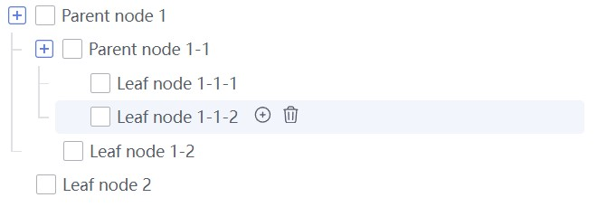

# vxeTree
A powerful tree component for Vue3

## Installing
Install with npm:
```
npm install vxe-tree
```
Import in your project:
```js
import vxeTree from 'vxe-tree';

//import the styles
import 'vxe-tree/index.css';

Vue.use(vxeTree);
```
Example tree with check and edit


## Features
- Lazy-loading 
- Checkbox selection
- Disabled and Default state
- Custom icons
- Search filtering
- Virtual scrolling
- Drag and drop functionality
- Action buttons

Please refer to the documentation for specific usage

## Theme customization
After introducing the default styles, introduce your own styles
```css
:root {
  --vxe-brand: red; //checkBox style
  --vxe-list-item-selected-bg: blue; //selected style
  --vxe-list-item-hover-bg: yellow; //hover style
}
```


## License
MIT License © 2023 [mengqiuleo](https://github.com/mengqiuleo)